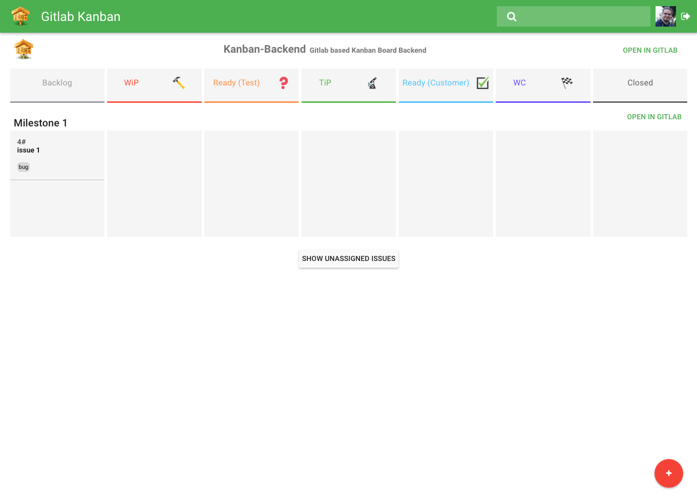

# Simple Gitlab Kanban Frontend

Gitlab based Kanban Board Frontend

* AngularJS Based
* Style with [AngularMaterial](https://material.angularjs.org/latest/)
* Enter api token to auth (save with local storage)
* Use hpm/kanban-backend
* Set issue & milestone state with [gitlab emoticons](http://emoji.codes/) :bug:

| Row              | Icon                    | Icon-Code                 |
| ---------------- |:-----------------------:|:-------------------------:|
| Backlog          |                         |                           |
| WiP              | :hammer:                | `:hammer:`                |
| Ready (Test)     | :question:              | `:question:`              |
| TiP              | :microscope:            | `:microscope:`            |
| Ready (Customer) | :ballot_box_with_check: | `:ballot_box_with_check:` |
| WC               | :checkered_flag:        | `:checkered_flag:`        |

## Run

* `bower install`
* enter your config in `public/src/app/kanban.config.dist.js` and rename to `kanban.config.js`
* cd into public
* start `http-server`